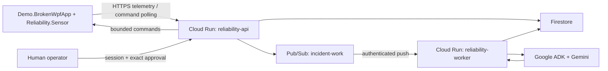

# WPF Reliability Agent

An evidence-driven reliability agent that turns WPF binding, UI, and performance signals into a cloud incident where Gemini requests bounded diagnostics, a human approves the single typed mitigation, and before/after evidence verifies the result.

## Problem

WPF binding, UI, exception, and rendering signals are fragmented across trace output and runtime state that ordinary logs and APM metrics do not correlate into a WPF-specific diagnosis. Traditional monitoring can report symptoms but does not safely request targeted diagnostics, bind a proposed action to the exact evidence and human approval, execute the typed mitigation once, and verify the result.

## Why an Agent

Gemini, orchestrated through Google ADK, chooses the next bounded read-only diagnostic from the evidence already collected and produces schema-validated hypotheses or proposals. Deterministic code owns every trust boundary: event validation, tool allowlists, budgets, state transitions, idempotency, risk classification, exact approval binding, command execution, post-action verification, and report validation. The model can recommend; it cannot bypass policy or directly mutate Windows, files, processes, or source code.

## Features

- In-process WPF binding, exception, UI-tree, and rendering/performance diagnostics with bounded payloads and a durable SQLite relay.
- Authenticated HTTPS telemetry ingestion, Firestore incident/evidence state, Pub/Sub work dispatch, and one durable workflow step per worker invocation.
- Google ADK and Gemini investigation that can request only the registered read-only diagnostic tools and must cite collected evidence.
- Deterministic LOW/MEDIUM/HIGH/BLOCKED policy with exact human approval for the single P0 mutation, `recovery.set_feature_flag`.
- Exactly-once command completion plus binding, performance, and visual post-action evidence before an incident can become `MITIGATED`.
- Authenticated incident dashboard and schema-validated JSON, Markdown, and HTML reports.

## Architecture

The P0 design uses one in-process WPF sensor, HTTPS telemetry batches and command long-polling, one Python package deployed from one image as two Cloud Run services, Pub/Sub, Firestore, Google ADK, and Gemini.



`reliability-api` is the public HTTPS ingress, command, approval, dashboard, and report surface. `reliability-worker` is private and advances one durable incident step per authenticated Pub/Sub invocation. Both roles run the same immutable container image; Firestore is the durable source of incident, evidence, proposal, approval, command, audit, and report state.

## Quickstart

### Prerequisites

The repository is verified on Windows with .NET SDK `8.0.319`, Python `3.12.10`, and Google Cloud SDK `579.0.0`. Use a .NET 8 SDK, Python 3.12, Git, and a current `gcloud` CLI. PowerShell is required for the deployment and cleanup scripts.

Docker Desktop and WSL are not local prerequisites. Container builds run on GitHub-hosted Linux CI or Google Cloud Build.

### Local test environment

Create the repository-local Python environment once, install only the cloud test extras into it, then run the Windows and cloud suites independently:

```powershell
py -3.12 -m venv .venv
Push-Location src\cloud
..\..\.venv\Scripts\python.exe -m pip install -e ".[test]"
Pop-Location

dotnet restore WpfReliabilityAgent.sln
dotnet build WpfReliabilityAgent.sln -c Release --no-restore
.\.venv\Scripts\python.exe -m pytest src\cloud\tests -q
dotnet test src\windows\Reliability.Sensor.Tests\Reliability.Sensor.Tests.csproj -c Release --no-build
dotnet test src\windows\Demo.BrokenWpfApp.Tests\Demo.BrokenWpfApp.Tests.csproj -c Release
```

No Cloud emulator or live Google Cloud project is required for these tests. Cloud boundaries use FastAPI `TestClient` plus deterministic fakes/stubs for Firestore, Pub/Sub, authentication, and model interactions, so the normal unit/integration loop does not make billable cloud calls.

### Google Cloud deployment

Use a dedicated Google Cloud project with billing enabled and an authenticated `gcloud` account that can enable APIs, create service accounts/IAM bindings, use Cloud Build, and deploy Cloud Run. From an empty project, deployment is intentionally two-stage because runtime tokens must not be generated or stored by the repository:

```powershell
$ProjectId = "your-project-id"
gcloud auth login
gcloud config set project $ProjectId

# First pass: create project-scoped prerequisites and Secret Manager placeholders.
.\scripts\deploy.ps1 -ProjectId $ProjectId
```

On a new project the first pass stops once it confirms that the two Secret Manager placeholders do not yet have enabled versions. Provision those values as described below, then rerun the same command. The second pass is idempotent for existing prerequisites, submits the cloud image build, deploys `reliability-api` and `reliability-worker`, configures authenticated Pub/Sub push and the dead-letter topic, runs deployment smoke checks, and prints the API URL plus the three Windows configuration variables.

### Secret and token provisioning

Generate both demo tokens locally and stream them directly into Secret Manager without writing a token file into the repository. The Python commands intentionally omit a trailing newline so the stored secret exactly matches the bearer token:

```powershell
.\.venv\Scripts\python.exe -c "import secrets,sys; sys.stdout.write(secrets.token_urlsafe(32))" | gcloud secrets versions add reliability-device-token --project $ProjectId --data-file=-
.\.venv\Scripts\python.exe -c "import secrets,sys; sys.stdout.write(secrets.token_urlsafe(32))" | gcloud secrets versions add reliability-operator-token --project $ProjectId --data-file=-

.\scripts\deploy.ps1 -ProjectId $ProjectId
```

Do not place either token in `.env`, source files, test fixtures, shell history arguments, or committed documentation. For a demo shell, populate the WPF process environment from Secret Manager without printing the value:

```powershell
$env:WPF_RELIABILITY_API_BASE_URI = (gcloud run services describe reliability-api --region asia-east1 --project $ProjectId --format="value(status.url)").Trim()
$env:WPF_RELIABILITY_DEVICE_ID = "demo-device"
$env:WPF_RELIABILITY_DEVICE_TOKEN = (gcloud secrets versions access latest --secret reliability-device-token --project $ProjectId).Trim()
```

The operator token is separate from the device token and is accepted only by the operator login flow; retrieve it from Secret Manager only for the operator session that needs it.

### Cleanup Google Cloud resources

When the demo is finished, remove project resources so Cloud Run, Pub/Sub, Artifact Registry, Secret Manager, and build-staging storage do not keep accumulating usage. The cleanup script requires the project ID twice and refuses a non-exact confirmation:

```powershell
.\scripts\cleanup-cloud.ps1 -ProjectId $ProjectId -ConfirmProjectId $ProjectId
```

The default cleanup preserves the Firestore database so incident evidence remains available. For a disposable demo project, delete Firestore too once that evidence is no longer needed:

```powershell
.\scripts\cleanup-cloud.ps1 -ProjectId $ProjectId -ConfirmProjectId $ProjectId -DeleteFirestore
```

The script is project-scoped and does not delete the Google Cloud project itself.

## Reuse

This is a new independent repository, not a fork of `wpf-devtools-mcp`. Reuse is limited to a design reference for instance-level WPF binding trace capture and an adapted binding-correlation regression trace, both pinned to upstream revision `900ac97cf9b69b4a3c1f4899b08c9b1e78212af3` under Apache-2.0. The complete MCP server, Inspector transport, Injector, Bootstrapper, Composer, installer, release, and signing infrastructure are not reused.

See the full [reuse disclosure](REUSE_DISCLOSURE.md) and machine-readable [reuse manifest](reuse-manifest.json) for exact source paths, destination paths, reuse types, and adaptation summaries.

## Security boundaries

The WPF sensor runs in-process and can execute only recovery handlers explicitly registered by the host app. Device traffic leaves Windows over HTTPS with a bearer token; Pub/Sub invokes the private worker with OIDC; worker-to-Gemini input is bounded and redacted; operator actions require the demo operator token, a signed HTTP-only session cookie, and CSRF validation.

The deterministic policy allowlists nine LOW-risk read-only tools: `health.get_snapshot`, `binding.get_errors`, `binding.get_live_candidates`, `exception.get_recent`, `ui.get_subtree`, `ui.get_element_details`, `performance.sample`, `state.compare_snapshots`, and `source.lookup_binding`. The only mutation is HIGH-risk `recovery.set_feature_flag`, bound to the exact approved arguments and evidence. Unknown tools are `BLOCKED`.

The following command classes are permanently blocked and have no P0 executor: `shell.execute`, `powershell.execute`, `file.write`, `source.apply_patch`, `process.kill`, `process.restart`, `dll.inject`, `memory.read`, `credential.read`, `registry.write`, `git.commit`, and `git.push`. Screenshot/OCR capture, arbitrary source reads/writes, environment dumps, and arbitrary process control are also outside the P0 surface. UI text, binding paths, exceptions, source snippets, tool results, and application logs are treated as untrusted evidence data, never as instructions.

## Demo

The primary scenario is an `ExperimentalPeopleGrid` binding storm with rendering degradation. A verified feature rollback is reported as `MITIGATED`, never `RESOLVED`.

### Run the deployed demo

1. Reset the scenario. In the PowerShell session where the three `WPF_RELIABILITY_*` variables above are set, launch the app:

   ```powershell
   dotnet run --project .\src\windows\Demo.BrokenWpfApp\Demo.BrokenWpfApp.csproj -c Release
   ```

   If the safe fallback is already visible, click **Reset Demo**. The status must read `Feature: ENABLED (broken)` and the experimental grid must be visible.
2. Trigger the incident by leaving the broken grid enabled. No load generator or manual fault injection is required: app startup installs the in-process sensor, and the deliberate `DisplayNmae` binding automatically emits bounded binding telemetry while the grid supplies rendering/performance evidence.
3. Observe the cloud workflow with an operator session. Keep the operator token in memory rather than printing or writing it to disk:

   ```powershell
   $OperatorToken = (gcloud secrets versions access latest --secret reliability-operator-token --project $ProjectId).Trim()
   $ConsoleSession = New-Object Microsoft.PowerShell.Commands.WebRequestSession
   $LoginBody = @{ token = $OperatorToken } | ConvertTo-Json -Compress
   Invoke-WebRequest -Method Post -Uri "$env:WPF_RELIABILITY_API_BASE_URI/console/login" -WebSession $ConsoleSession -ContentType "application/json" -Body $LoginBody | Out-Null
   (Invoke-WebRequest -Uri "$env:WPF_RELIABILITY_API_BASE_URI/console/incidents" -WebSession $ConsoleSession).Content
   ```

   The incident list shows the incident ID, state, summary, and update time. Request `/console/incidents/<incident-id>` with the same `$ConsoleSession` to inspect the timeline, evidence, hypotheses, tool ledger, approval, verification, and report. After the exact HIGH-risk recovery action is approved and verified, the WPF app switches to the safe fallback and the incident is reported as `MITIGATED`. Click **Reset Demo** to restore the broken grid for the next rehearsal.
