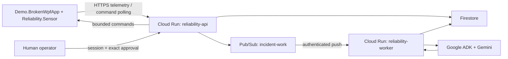

# WPF Reliability Agent

An evidence-driven reliability agent that turns WPF binding, UI, and performance signals into a cloud incident where Gemini requests bounded diagnostics, a human approves the single typed mitigation, and before/after evidence verifies the result.

## Problem

WPF binding, UI, exception, and rendering signals are fragmented across trace output and runtime state that ordinary logs and APM metrics do not correlate into a WPF-specific diagnosis. Traditional monitoring can report symptoms but does not safely request targeted diagnostics, bind a proposed action to the exact evidence and human approval, execute the typed mitigation once, and verify the result.

## Why an Agent

Gemini, orchestrated through Google ADK, chooses the next bounded read-only diagnostic from the evidence already collected and produces schema-validated hypotheses or proposals. Deterministic code owns every trust boundary: event validation, tool allowlists, budgets, state transitions, idempotency, risk classification, exact approval binding, command execution, post-action verification, and report validation. The model can recommend; it cannot bypass policy or directly mutate Windows, files, processes, or source code.

## Features

- In-process WPF binding, exception, UI-tree, and rendering/performance diagnostics with bounded payloads and a durable SQLite relay.
- Authenticated HTTPS telemetry ingestion, Firestore incident/evidence state, Pub/Sub work dispatch, and one durable workflow step per worker invocation.
- Google ADK and Gemini investigation that can request only the registered read-only diagnostic tools and must cite collected evidence.
- Deterministic LOW/MEDIUM/HIGH/BLOCKED policy with exact human approval for the single P0 mutation, `recovery.set_feature_flag`.
- Exactly-once command completion plus binding, performance, and visual post-action evidence before an incident can become `MITIGATED`.
- Authenticated incident dashboard and schema-validated JSON, Markdown, and HTML reports.

## Architecture

The P0 design uses one in-process WPF sensor, HTTPS telemetry batches and command long-polling, one Python package deployed from one image as two Cloud Run services, Pub/Sub, Firestore, Google ADK, and Gemini.

`reliability-api` is the public HTTPS ingress, command, approval, dashboard, and report surface. `reliability-worker` is private and advances one durable incident step per authenticated Pub/Sub invocation. Both roles run the same immutable container image; Firestore is the durable source of incident, evidence, proposal, approval, command, audit, and report state.

## Quickstart

### Prerequisites

The repository is verified on Windows with .NET SDK `8.0.319`, Python `3.12.10`, and Google Cloud SDK `579.0.0`. Use a .NET 8 SDK, Python 3.12, Git, and a current `gcloud` CLI. PowerShell is required for the deployment and cleanup scripts.

Docker Desktop and WSL are not local prerequisites. Container builds run on GitHub-hosted Linux CI or Google Cloud Build.

## Reuse

Selected WPF diagnostic concepts and primitives are adapted from `Evanlau1798/wpf-devtools-mcp` at pinned upstream source revision `900ac97cf9b69b4a3c1f4899b08c9b1e78212af3`. See `REUSE_DISCLOSURE.md` and `reuse-manifest.json`.

## Security

P0 exposes bounded read-only diagnostics and one typed mutation, `recovery.set_feature_flag`, which requires exact human approval. Arbitrary shell, file, process, injection, screenshot, OCR, and source-write capabilities are excluded.

## Demo

The primary scenario is an `ExperimentalPeopleGrid` binding storm with rendering degradation. A verified feature rollback is reported as `MITIGATED`, never `RESOLVED`.
